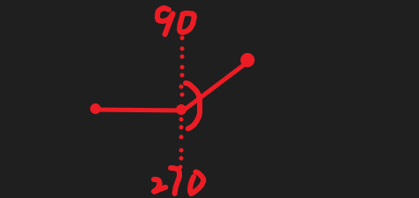
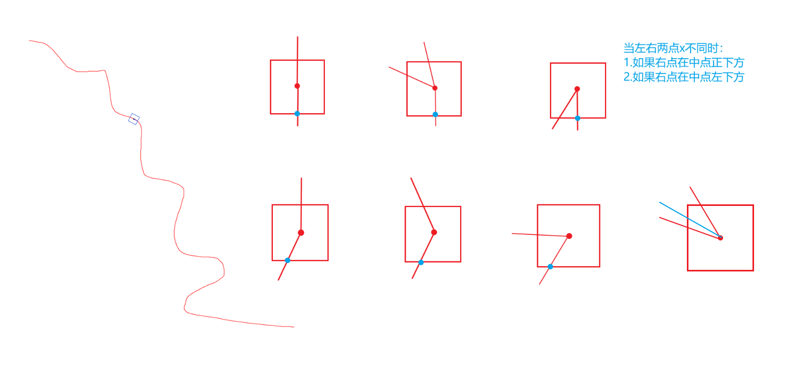
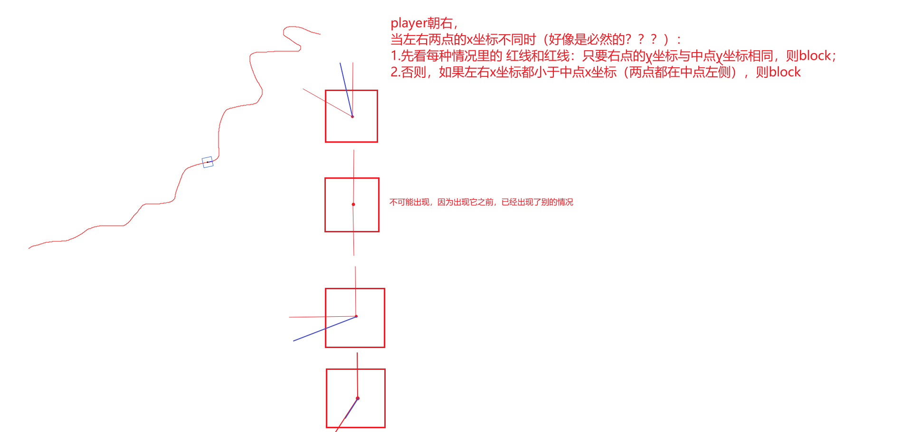
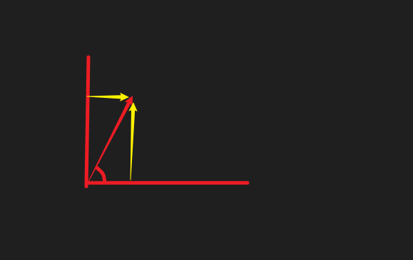

# 计算地形角度：
永远都是right point 的x和y - left point 的x和y(先将left point和 right point的坐标转为笛卡尔坐标系下的坐标)

# 炮弹发射角度
应该由 武器基础角度、angle + direction 决定

# drop 和 block 地形 
依据center point 与 left point, center point 与 right point之间的夹角决定：??? 

1. drop: 

    

    掉落的逻辑：
    如果是向右，则 在中点右侧5像素的位置 垂直向下找第一个地形交点

2. block: 

    

3. air: 

# 发射炸弹 
1. 绘制炸弹的轨迹 √

    

2. 碰撞检测 √
    性能优化 √

# 炸毁和描边 √

# move
松开时（keyup） 要停止move

按下时，加个锁 持续向前move

# smooth moving
使用requestAnimationFrame实现 从点A到点B（progress从0到1）的平滑移动：
移动到B后，再从点B移动到点C 保证顺滑衔接 

当前在点A，已知点B，
在向B移动的起始时刻，根据点B计算点C的位置
